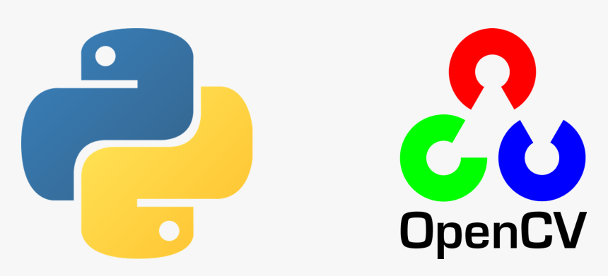

# Image Processing tutorial


## Introduction

This repository is designed to help you learn and master image processing using OpenCV, a powerful and popular library for computer vision. Whether you are just starting or looking to deepen your knowledge, you'll find valuable resources here.

## Getting Started

To get started with the materials in this repository, you'll need to have Python and OpenCV installed. Follow the instructions below to set up your environment:

### Installation

1. **Python**: Make sure you have Python installed. You can download it from [python.org](https://www.python.org/).
2. **OpenCV**: Install OpenCV using pip:
    ```bash
    pip install opencv-python
    ```

## Code Samples

You can find code samples for each topic in their respective directories. Each script is well-commented to help you understand the concepts and techniques being implemented.

## Resources

Here are some additional resources to further your learning:

- [OpenCV Documentation](https://docs.opencv.org/)
- [OpenCV Tutorials](https://docs.opencv.org/master/d9/df8/tutorial_root.html)
- [OpenCV GitHub Repository](https://github.com/opencv/opencv)

## Contributing

Contributions are welcome! If you have any suggestions, improvements, or bug fixes, feel free to submit a pull request. Please ensure your contributions adhere to the following guidelines:

- Provide clear descriptions and comments for your code.
- Ensure compatibility with the existing codebase.
- Follow the coding style and conventions used in this repository.

# Happy coding and happy learning!